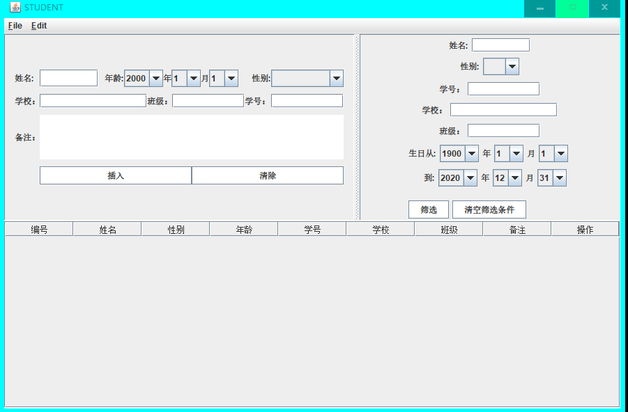
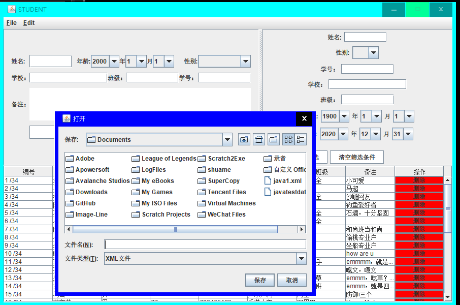
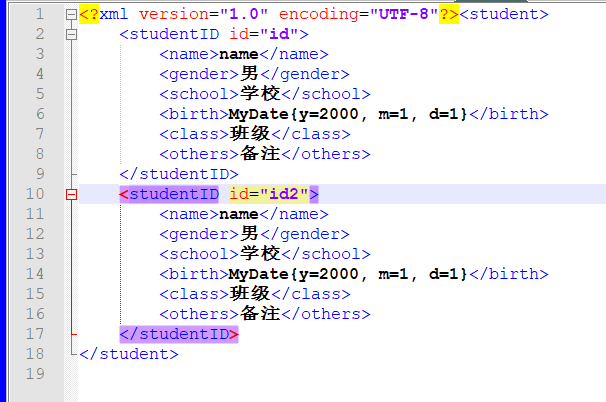
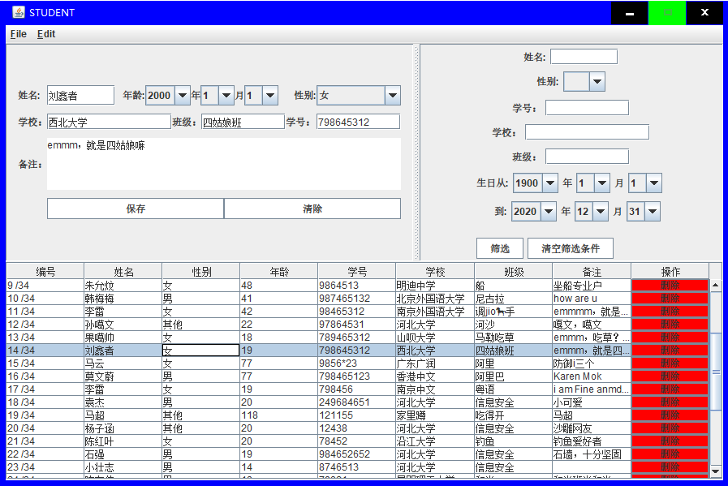
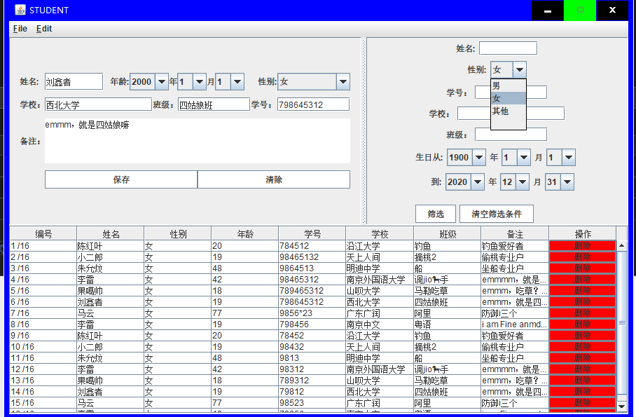
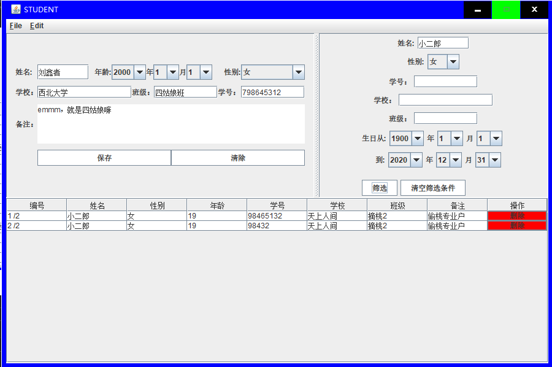

# 学生管理系统

大一学 Java 时候写的作业，学生管理系统

当初 Java 也肝了不少代码，后来一看就 Java 就口x，后来连个 hello world 都 run 不出来了。

可能是因为当初去写了一次 spring boot ....

再也没有碰过 Java ，还是 C 好，神奇的海螺。

## 特性功能

> 就一个作业有啥好写的....

+ 学生插入删除查找
+ 还有筛选功能，根据年龄性别等条件筛选
+ 支持导入导出，使用 xml 文件
+ .....自己试吧

> 支持筛选操作，但是不支持模糊搜索，模糊搜索部分不想再做了，感觉很累，就先这么着吧，
>
>选中列表某一行会及那个信息自动填充到上面的框里面，但是目前我还没有支持直接在单元格内编辑保存，不过，监听什么的我全部写好了，只要稍加十几行代码就可以实现，同样也不想再写了，虽然区区十几行代码，还是不想动手。以后随缘再说。

姓名筛选：
> 只有id为主键，id是唯一的，其他字段都允许重复
>
>单元格最后一行，点击会提示是否删除改行。
>
>这一部分代码我写的累赘了，但是，为了学有所用，用另一种方法实现，而不是在原有方法里面加条件来实现是个很好的事情，所以我没有精简代码

>其他筛选条件类似

我记得我的老师，这份作业只给了我 70 分，心痛....

多少有点心塞，理想主义者的心塞

## screenshots

star.,.,.,.,.
